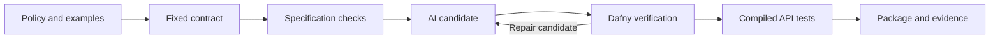

<div align="center">

# ✦ Stellar

**Verifiable AI-generated code. Reviewed contracts. Inspectable evidence.**

[](#beta-scope)
[](#license-and-sustainability)
[](#quick-start)
[](#quick-start)

</div>

Stellar is an experimental framework for accepting AI-generated library code only when it satisfies a fixed formal contract and passes independent checks of the specification and compiled implementation.

The first beta contains **20 deterministic business rules**, **210 explicit examples per policy version**, two maintenance revisions, and adversarial experiments. It uses **Dafny 4.11.0**, **Z3 4.12.1**, and a JavaScript compilation target. Its acceptance runner is written in Node.js.

> A successful proof can establish the wrong requirement. Stellar makes specification validation part of the acceptance process and records exactly what was checked.

## What the beta does

- Accepts AI-proposed expressions through a small, strict candidate format.
- Keeps contracts, policy examples, oracles, and checker configuration outside that format.
- Checks non-vacuity witnesses, intended-input coverage, expected outputs, and forbidden outputs.
- Proves the candidate's contract with Dafny, including invalid numeric inputs and guarded division.
- Audits assumptions and rejects missing, ambiguous, failed, or unresolved mandatory evidence.
- Compiles the same verified source and tests its public JavaScript API using exact integer arithmetic.
- Records hashes of the candidate, specification, generated source, toolchain configuration, and tested package.
- Exercises refactoring, an explicit requirements revision, and deliberately defective submissions.



## Quick start

The beta requires **Windows x64**, **Node.js 24**, Git, and Windows PowerShell 5.1 or later. Downloading dependencies requires internet access. Dafny is installed inside the checkout; no global Dafny or .NET installation is needed.

```powershell
git clone https://github.com/4kaws/Stellar.git
cd Stellar
npm ci --ignore-scripts
npm run setup
npm test
npm run pilot
```

`setup` downloads the pinned official Dafny distribution, verifies its checksum and installed contents, and checks the trusted baseline. `pilot` runs the baseline, maintenance checks, and seeded adversarial experiments. The full run takes longer than the unit tests because it executes real verification and compilation.

Read the resulting summary in `reports/PILOT_RESULTS.md`. Detailed receipts, generated Dafny source, verifier logs, compiled packages, and runtime results are created under `artifacts/`.

```powershell
node examples/use-package.cjs
```

This loads the baseline package from the latest successful pilot run and exercises discount, inventory, and transfer rules.

## Submit an AI-generated candidate

Create a prompt for your preferred model:

```powershell
node src/cli.mjs prompt v1
```

The response must be JSON with all 20 implementations. This excerpt illustrates the format:

```json
{
  "schemaVersion": 1,
  "label": "my-candidate",
  "implementations": {
    "discount": "if price < 0 || bps < 0 || bps > 10000 then -1 else price * (10000 - bps) / 10000"
  }
}
```

Use `candidates/baseline.json` as the complete schema example. Save the model's complete response to a JSON file and check it:

```powershell
node src/cli.mjs check --candidate candidates/baseline.json --policy v1
```

Candidates can contain integer arithmetic, comparisons, Boolean expressions, and Dafny `if/then/else` expressions. They cannot contain calls, imports, declarations, statements, attributes, assumptions, or contract edits. This is an intentional language restriction; Stellar does not execute arbitrary agent-authored scripts.

The beta does not include an online model provider or require an API key. The initial candidates were generated during development. This makes the acceptance process reproducible without a paid model account; model success rates and generation costs remain a future experiment.

## What “accepted” means

Only the full pipeline can produce **`accepted-for-pilot`**. All mandatory stages must pass. A timeout, inconclusive proof, missing report, or changed artifact blocks acceptance.

The Dafny proof concerns the precise, total mathematical-integer functions under the selected contracts. The compiled public API accepts canonical decimal strings of at most 200 characters and returns decimal strings. Invalid numeric arguments return `"-1"`; malformed encodings or incorrect argument counts throw `TypeError`.

For example, the compiled API behaves as follows:

```javascript
rules.discount("101", "5000");             // "50": payable cents, rounded down
rules.transfer_remaining("100", "101");   // "-1": insufficient balance
rules.inventory_available("25", "7");     // "18"
```

`check --mode tests` and `check --mode formal` are experimental comparison modes. They produce **`experiment-passed`**, never full acceptance. The seeded rare-branch experiment demonstrates why finite tests alone can miss incorrect implementations.

Inspect a local receipt with:

```powershell
node src/cli.mjs inspect artifacts/<run-directory>/report.json
```

Receipt inspection checks local evidence completeness and integrity against the current baseline. Receipts are unsigned and must not be treated as authenticated certificates from unknown parties.

## The 20 components

| Family | Components |
|---|---|
| Amounts and rounding | Discount, tax addition, proration, ceiling division |
| Balances and limits | Clamp, saturating subtraction, transfer remainder, refund cap |
| Business decisions | Shipping fee, loyalty points, tier rate, capped late fee |
| Inventory | Available inventory, reorder quantity |
| Intervals | Overlap length, membership in a half-open window |
| Calendar | Gregorian leap year, days in month |
| Ordering | Maximum of three, median of three |

[Policy definitions](docs/POLICIES.md) explain rounding, boundaries, and errors. These are **authored pilot defaults**, not universal business rules or independently approved customer requirements. The oracles are separate implementations of those defaults, not external certification.

## Maintenance is part of the pilot

`candidates/refactor.json` changes the implementation of every component while preserving behavior. Stellar verifies both the fixed contracts and equality with the baseline.

`candidates/requirements-v2.json` exercises a deliberately breaking policy revision: every numeric input must be at most one trillion. The v2 contracts and examples explicitly cover the changed behavior. This revision is simulated to test the workflow; it is not an unannounced change to v1.

```powershell
npm run evolve
npm run attacks
```

Trusted inputs are fingerprinted in `trusted/baseline-lock.json`. After a deliberate, reviewed source or policy change, update the baseline explicitly:

```powershell
node src/cli.mjs seal --accept-pilot-defaults
```

Sealing records a baseline; it does not certify its meaning. A worker that can rewrite both the trusted files and their lock can defeat that boundary. A hosted or multi-user deployment needs real separation of permissions, isolated workers, and authenticated evidence.

## Beta scope

This is a working research beta for small pure integer rules. It does not yet handle arbitrary application code, stateful services, loops, concurrency, external APIs, or Lean proof artifacts. The proof and packaging toolchain remains trusted. Host integration, resource limits, and operational security require additional evidence appropriate to the application.

The runner itself is tested but has not been formally verified. The pilot's seeded defects are useful regression checks; they are not a statistical estimate of production reliability. Human review time, proof-repair cost, model comparisons, and actual dependency-upgrade experiments are not measured yet.

See [toolchain and trust assumptions](docs/TOOLCHAIN.md), [security scope](SECURITY.md), and the [research assessment](RESEARCH_AND_DESIGN.md).

## Research foundation

Stellar combines established ideas rather than inventing a new proof system:

- [IronSpec, OSDI 2024](https://www.usenix.org/conference/osdi24/presentation/goldweber): testing formal specifications.
- [Clover, 2024](https://arxiv.org/abs/2310.17807): consistency between code, documentation, and contracts.
- [AutoVerus, OOPSLA 2025](https://arxiv.org/abs/2409.13082): automated proof generation under supplied specifications.
- [MutDafny, ICSE 2026](https://arxiv.org/abs/2511.15403): using implementation mutations to expose specification weaknesses.

The [full assessment](RESEARCH_AND_DESIGN.md) distinguishes these results from the guarantees of this beta.

## License and sustainability

Stellar's original code and documentation are available under **MIT OR Apache-2.0**, at your option. See [LICENSE-MIT](LICENSE-MIT) and [LICENSE-APACHE](LICENSE-APACHE). Third-party components retain their own notices in [THIRD_PARTY_NOTICES.md](THIRD_PARTY_NOTICES.md).

These licenses allow commercial use. Development can be supported through donations, sponsorship, paid support, or hosted services while keeping the core open source. Funding and governance arrangements can grow with the project; no donation account or foundation is implied by the license.

Contributions are welcome, especially stronger specification tests, independent policy review, small verified examples, and improvements to the acceptance runner. Start with [CONTRIBUTING.md](CONTRIBUTING.md).
