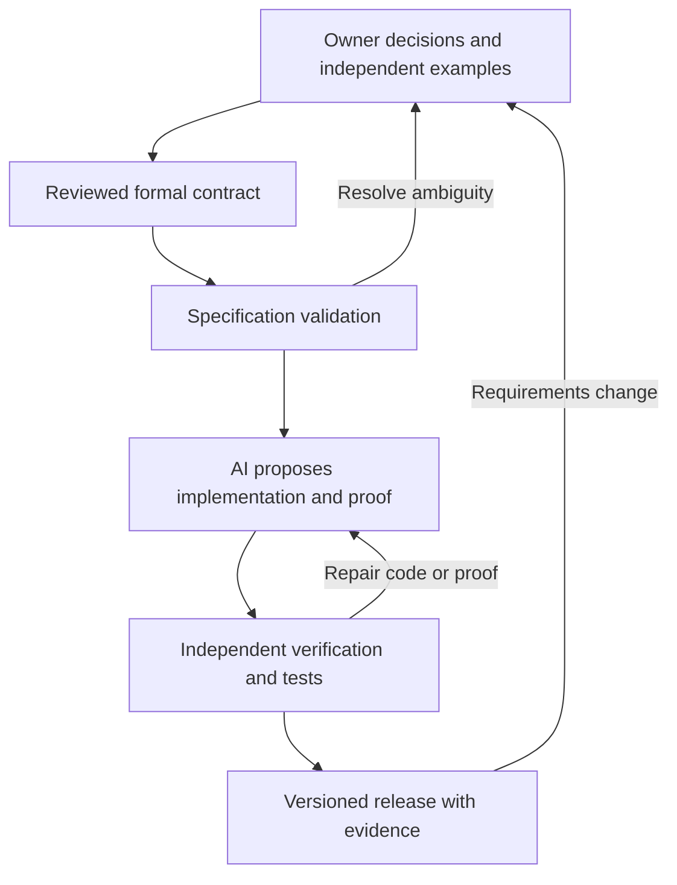

# A framework for reliable LLM-generated libraries

Research assessment and proposed design, 6 September 2026. Initial scope: small, deterministic libraries and business rules, as selected by the project owner. This document describes a proposal; it does not report an implemented or validated framework.

**Decision: proceed with a bounded prototype.** Existing work supports combining AI generation, specification validation, formal verification, and conventional production engineering. The defensible promise is that accepted components satisfy identified contracts under recorded assumptions. The evidence does not support automatic production readiness for arbitrary applications from informal prompts.

The important distinction is between generation success and acceptance reliability. A generator can fail frequently while its successful outputs are rigorously checked. A generator that nearly always returns something is unsuitable if incorrect specifications or unchecked assumptions can pass its acceptance process. The framework must be able to return an unresolved result.

**1. Assessment of the seven observations**

1. **Test, check, verify, maintain, and evolve: agree.** These activities establish different evidence. Tests examine executions; verification establishes specified properties in a model; integration and performance work examine deployment concerns; maintenance preserves the evidence as the system changes. EvalPlus demonstrated that substantially expanding benchmark tests exposes previously accepted incorrect LLM-generated programs. Its results concern coding benchmarks, not production failure probabilities. [EvalPlus, NeurIPS 2023](https://arxiv.org/abs/2305.01210).

2. **Prefer concise, safe, readable code: agree, with a different optimization target.** Minimize unnecessary concepts, dependencies, public interfaces, and review effort. A few extra explicit branches may be easier to understand and prove than a clever expression. Count executable code and proof/specification artifacts separately. Proofs can exceed the implementation in size: Verus's SOSP 2024 case studies reported 6.1K implementation lines and 31K proof lines. A study of 127 maintainability issues also found that LLM fixes could introduce errors or further issues; readability improvement alone was insufficient. [Verus paper](https://www.microsoft.com/en-us/research/wp-content/uploads/2024/09/verus.pdf), [maintainability study, 2025](https://arxiv.org/abs/2502.02368).

3. **Generate English and Lean proofs, while preventing statement changes: agree with the trust boundary.** English explanations help review and future repair; they are not machine-checked evidence. A checked proof concerns its precise formal statement. An April 2026 study of 303 logical reasoning tasks observed fabricated axioms and mistranslated premises in a separated formalization/proving pipeline, but found no evidence of systematic gaming in unified generation. Treat such changes as a possible failure mode, not inevitable behavior. AI-assisted formalization is useful when externally validated; an agent's own interpretation cannot authorize the contract it later proves. [Do LLMs Game Formalization?, 2026 non-archival workshop paper](https://arxiv.org/abs/2604.19459).

4. **Where does the specification come from? This is the central requirements problem.** Sources include decisions by the domain owner, relevant standards, interface obligations, worked examples, rejected outcomes, historical incidents, and existing behavior. Record which source supports each rule and who resolves contradictions. Legacy behavior is evidence, not automatically desirable behavior. An LLM can expose ambiguities and propose alternatives, but cannot decide whether a refund should round up or down without an authoritative policy. Jackson's foundational account distinguishes requirements in the world from machine specifications and their environmental assumptions. [The World and the Machine, ICSE 1995](https://users.ece.utexas.edu/~perry/education/SE-Intro/jackson-icse95.pdf).

5. **Verification and agreement on specifications are hard: agree.** Restrict the initial domain and reuse trusted definitions. Build modules around small, explicit contracts; resolve ambiguous examples before generating implementations. VERINA separates code, specification, and proof generation over 189 Lean tasks and finds substantial differences between those capabilities. Its model-specific results are evidence of distinct difficulties, not universal limits on current models. Refinement can prove one formal specification satisfies another, but ultimate alignment with stakeholder intent still needs validation. [VERINA, March 2026 revision](https://arxiv.org/abs/2505.23135).

6. **Impossible preconditions create false confidence: exactly right.** A callee can satisfy its contract vacuously when no input meets its precondition. Sound modular verification still requires verified callers to establish that precondition; external callers or omitted verification can leave this obligation unchecked. Satisfiable but excessively restrictive preconditions are another problem. Dafny already provides proof-dependency diagnostics for contradictory and redundant assumptions. Their absence is not proof of specification adequacy. [Dafny proof-dependency analysis](https://dafny.org/blog/2023/10/27/proof-dependencies/).

7. **Test the specification itself: strongly agree, alongside testing the code.** IronSpec provides sanity checking, specification tests expressed as proofs, and specification mutation. It found ten specification bugs across six real-world verified systems in an evaluation of 14 specifications. This directly supports making specification validation an independent framework stage. Passing those checks still does not prove complete alignment with intent. [IronSpec, OSDI 2024](https://www.usenix.org/conference/osdi24/presentation/goldweber).

**2. What the specification gate must establish**

For illustration, consider a terminating pure function `f`, precondition `P`, and postcondition `Q`. A functional correctness obligation has the shape:

```text
For every x: P(x) implies Q(x, f(x)).
```

If `P(n)` is `n > 0 and n < 0`, this implication holds regardless of the returned value. If `P(n)` instead admits only `n = 0`, the contract is satisfiable but may exclude nearly every intended call. If `Q` is always true, no result is constrained. These are distinct defects.

The following are proposed checks, not a claim that specification correctness is generally decidable. Let `D` be an independently reviewed description of the intended input domain; include relevant environment assumptions and state invariants when applicable.

| Check | Evidence to seek | Important limit |
|---|---|---|
| Non-vacuity | Concrete, checked witnesses satisfying `P` and the applicable invariants | One witness establishes only that at least one call is possible |
| Intended-domain coverage | Prove `D(x) => P(x)` where tractable; otherwise test independently chosen input classes and label that evidence | Defining `D` from the generated `P` makes this circular |
| Output feasibility | For each admitted input, an allowed output exists: `P(x) => exists y. Q(x,y)` | This alone does not provide an executable, terminating implementation or solve reactive synthesis |
| Positive behavior | Expected input/output pairs satisfy the contract | Examples can be incomplete or mistaken |
| Negative behavior | Forbidden results are rejected for admitted inputs | Alternative results may legitimately be allowed by an intentionally nondeterministic contract |
| Reachability | Important branches and state transitions have reachable witnesses | An inconsistent local branch can be intentional; inspect the intended scope |
| Specification strength | Known faulty implementations violate a fixed contract | Equivalent mutations and intentional freedom must be distinguished from gaps |
| Specification-test strength | Tests or independently trusted properties expose harmful specification mutations | Mutation scores are diagnostic, not correctness probabilities |
| Composition | Callers establish preconditions; state changes respect frame conditions and invariants | An isolated callee proof does not discharge its clients' obligations |

Do not express every specification test as `P(x) => Q(x,y)` and silently skip inputs for which `P` is false. For an intended-valid example, check `P(x)` separately, then `Q(x,y)`. Record rejected/discarded input counts in generated tests. Otherwise the test harness can reproduce the exact vacuity it is meant to detect.

For specifications with quantifiers or ghost state that cannot be executed, generate proof obligations or solver queries for these examples. A failed proof attempt is **unknown** unless there is evidence establishing the violation. Likewise, a verifier timeout is neither a successful proof nor a checked counterexample. The FMCAD 2024 user-intent formalization work uses trusted examples and mutated outputs, and explicitly discusses this distinction in interpreting verification failures. [Evaluating LLM-driven User-Intent Formalization](https://arxiv.org/html/2406.09757v2).

MutDafny provides the complementary direction: mutate implementations while retaining their specifications. Its ICSE 2026 evaluation used 794 Dafny programs and identified five weak specifications through manual analysis. Surviving mutations require investigation because some are behaviorally equivalent. We should reuse this approach as a diagnostic and retain unresolved mutants as unresolved. [MutDafny, ICSE 2026](https://arxiv.org/abs/2511.15403).

**A small business-rule example.** Suppose the owner approves an integer discount calculator. Prices are cents; discounts are basis points; accepted discounts lie between 0 and 10,000. The owner chooses to round the final payable amount down, with no intermediate rounding. The intended result is `floor(price * (10000 - discount) / 10000)` for nonnegative prices; invalid arguments return a specified error. These are illustrative policy decisions, not universal accounting rules.

The specification tests should include zero price, zero discount, full discount, maximum supported price, negative inputs, out-of-range discounts, and rounding boundaries. For example, 101 cents with a 5,000-basis-point discount gives 50 cents under this policy. An implementation returning 51, truncating before multiplication, always returning zero, or rejecting every odd price should be rejected. The specification must also define representable integer ranges and the multiplication's overflow behavior. A theorem using unbounded integers does not automatically cover fixed-width host arithmetic.

Give the public API a total success/error contract over the supported host inputs, or separately verify its validation wrapper. An internal arithmetic core may require valid arguments, but that precondition alone establishes nothing about the promised errors on invalid public calls.

**3. Architecture and acceptance rules**



The contract can evolve, but a generation attempt cannot silently change its baseline. The following access boundaries are part of the proposed implementation, rather than prompts asking an agent to behave well.

| Component | Responsibility | Acceptance boundary |
|---|---|---|
| Requirements package | Rule IDs, sources, owner decisions, examples, input domain, error policy, assumptions | Changes require the designated owner's review |
| Contract package | Reviewed definitions, interfaces, predicates, imported models and semantic versions | Implementation/proof workers cannot alter the active package |
| Generator | Propose code, helper lemmas, invariants, proof steps and concise explanations | May request contract changes, but cannot approve them |
| Independent runner | Run approved verification, specification tests, code tests, audits and package tests | Generator cannot edit runner policy, trusted acceptance examples or reported results |
| Release record | Bind source, specification, proof and compiled package to tool/dependency versions | Every claim states its scope, assumptions and result category |

Separate agents are useful for finding different mistakes, but agreement between agents is not independent mathematical evidence. Their errors may be correlated. Trusted requirements and deterministic acceptance checks must remain authoritative.

Declare mandatory release obligations before generation begins. A timeout, unknown result, missing artifact, or failed mandatory check blocks acceptance. Informational checks remain explicitly labeled and cannot substitute for mandatory evidence.

For a Lean backend, use transitive axiom inspection, fresh proof rechecking, and a trusted challenge containing the intended statement. Audit referenced definitions as well as theorem text. The official guide distinguishes these checks and explains why a clean build alone is insufficient for untrusted submissions. [Lean proof validation](https://lean-lang.org/doc/reference/latest/ValidatingProofs/).

Lean's comparator can check a submitted proof against that trusted challenge and an explicit axiom allowlist, with optional external checkers. Keep challenge imports and build configuration controlled. Unconstrained definition holes still permit trivialization. Run generated build and metaprogramming code in isolation from the trusted checker environment. A normal Lean policy can permit its standard foundational axioms while rejecting unapproved additions. [Comparator implementation and trust assumptions](https://github.com/leanprover/comparator).

For Dafny, audit skipped verification, assumed lemmas, external contracts, and all active verification options. A concrete integration trap: `dafny audit` may return exit code zero while reporting findings, so the runner must inspect or compare its report. The command is documented as under development and cannot be the only enforcement mechanism. [Dafny reference: audit](https://dafny.org/latest/DafnyRef/DafnyRef#13618-dafny-audit).

Treat new assumptions, strengthened public preconditions, weakened guarantees, and changed definitions as contract changes. Proof-only work also preserves the implementation. Work that co-designs code and proof may change the implementation under the fixed contract, but the resulting proof must refer to that exact candidate. Dependency hashes help identify artifacts; they do not establish semantic correctness.

A release record should contain:

- The precise properties proved, including whether termination and error freedom are covered.
- Separate results for proofs, tests, bounded exploration, and unresolved obligations.
- Specification and implementation identities, proof dependencies, tool versions, build configuration, and package digest.
- The trusted components: logical foundations, checkers, translation tools, compiler/runtime, external models and libraries, as applicable.
- Input validation and caller obligations, supported configuration, and excluded properties.
- Human review decisions, performance results, and the evidence for compatibility with prior releases.

The honest release claim is specific: for example, this version computes the approved discount rule on its supported domain and returns the specified errors. Claims about latency, allocation limits, timing leakage, concurrency or surrounding infrastructure need their own evidence.

Run interoperability, input-validation, error-path, overflow and relevant fuzz tests against the compiled distributable and public wrappers. Include dependency review and performance measurements appropriate to the library. Tests against only the verified source or mathematical model do not exercise packaging and host-language integration.

**4. Practical technology choice**

| Route | Fit for this project | Tradeoff |
|---|---|---|
| Dafny with one compilation target | Recommended initial route for deterministic business rules and small libraries | Contracts and implementation can be verified together; translation and the target runtime remain part of the chosen trust boundary |
| Verus/Rust | Prefer if maintainable Rust source is a product requirement | Integrated contracts and executable Rust subset; SMT/tool/compiler trust and supported-feature limits must be recorded |
| Lean-native implementation, or Aeneas/Rust-to-Lean | Prefer when Lean proof artifacts are a primary requirement | A proof about the implementation needs a real semantic link; Aeneas provides a mechanical route for supported Rust, with translation/modeling limitations |
| A restricted, domain-specific language | Strong fit once one rule family or parser domain is established | Restriction makes validation easier, but building and maintaining a new language/compiler is substantial additional work |

Dafny documents C#, Java, JavaScript, Python and Go compilation paths; select one and validate interoperability before promising several. Aeneas documents translation of supported Rust into Lean and other proof systems, with exclusions including unsafe code and concurrency in its current scope. [Dafny installation and compilers](https://dafny.org/latest/Installation), [Aeneas](https://github.com/AeneasVerif/aeneas).

Do not make an LLM-written Lean version of an unrelated Python or TypeScript implementation the basis for claiming that implementation is verified. Either verify the actual source, use a mechanical translation with its trust assumptions recorded, or prove a refinement/equivalence connection. Differential testing can supply useful evidence across a translation boundary, but is not a proof of equivalence.

Ordinary SMT-backed Dafny or Verus verification is also different from replaying a proof term in Lean's kernel. A future requirement that every accepted component have a Lean-checkable proof changes the backend design and cost; it is not a free conversion of successful verifier output.

**5. Evidence of feasibility, and its limits**

| Work | What it demonstrates | What it does not establish |
|---|---|---|
| [Proof-Carrying Code, POPL 1997](https://people.eecs.berkeley.edu/~necula/papers.html) | The foundational architecture of an untrusted producer supplying evidence to a checker | Automatic discovery of the right business requirement |
| [Clover, SAIV 2024](https://arxiv.org/html/2310.17807v3) | Consistency checks between code, documentation and formal annotations; up to 87% acceptance of correct examples, with no observed false acceptances in its constructed adversarial evaluation | A universal zero-false-acceptance guarantee; evaluation centered on 60 textbook-level Dafny examples |
| [AutoVerus, OOPSLA 2025](https://arxiv.org/html/2409.13082v3) | Proof annotation generation succeeded on 137 of 150 tasks supplied with Rust code and specifications | Requirement discovery or autonomous production deployment; tasks were small benchmark programs |
| [3DGen, ICSE 2025](https://arxiv.org/abs/2404.10362) | AI-assisted format specifications refined through symbolic inputs and an external oracle, then used to generate verified C parsers; evaluated 20 formats | General faithful interpretation of arbitrary documentation without external validation |
| [Formally Verified Cloud-Scale Authorization, ICSE 2025](https://kwarc.info/people/frabe/Research/AWS_auth_25.pdf) | AWS developed a Dafny authorization engine, compiled readable Java, and validated behavior through differential and shadow testing, ultimately comparing against 10^15 production inputs | A lightweight autonomous process; this was a four-year specialist engineering effort, and agreement with legacy behavior is not proof of ideal policy |

These precedents mean the core ingredients already exist. The proposed contribution is their integration into a usable workflow: authoritative contracts, independent specification tests, controlled AI repair, explicit trust boundaries, and evidence that survives code changes. Whether that combination is economical for this project remains an empirical question.

**6. Maintenance and evolution**

Retain the verified source as the maintained source of truth; generated target code should be reproducibly rebuilt. Manual edits to generated code require a new verification connection and cannot inherit the original claim. Keep proof helpers modular and understandable, remove accidental redundancy, and measure proof repair effort as well as executable-code complexity.

For compatible changes to simple pure-function contracts, check that old inputs remain admitted (`P_old => P_new`) and that new guarantees imply old guarantees on the old domain (`P_old and Q_new => Q_old`). Stateful APIs additionally require reasoning about frames, invariants, exceptions and histories. Intentional breaking changes need a newly reviewed contract version. [Liskov and Wing, A Behavioral Notion of Subtyping, TOPLAS 1994](https://www.cs.cmu.edu/~wing/publications/LiskovWing94.pdf).

Changes to definitions, external models, dependencies, toolchains, or build settings can invalidate prior evidence. Track the dependency graph and rerun affected obligations; before release, check the complete selected release scope in a clean, pinned environment. Timeouts after an upgrade are unresolved proof work, not justification to weaken the specification. Preserve regression examples from every incident, including incidents caused by requirements or integration mistakes.

**7. Proposed pilot and decision criteria**

Start with roughly 20–30 small components covering integer calculations with explicit rounding, interval rules, ordering/deduplication with explicit policies, and deterministic decision tables. This is a proposed pilot size, not a research-derived optimum. Use one backend and one target runtime, then build a few realistic clients to exercise composition and input validation.

Run comparable tasks with the same generator and recorded budgets under three conditions: tests and review; those controls plus fixed-contract verification; and those controls plus independent specification validation and assumption auditing. Have a reviewer who did not generate the artifacts define held-out acceptance cases and judge ambiguous results. Benchmark contamination and task overlap should be recorded.

Challenge the gate with impossible preconditions, overrestricted inputs, tautological postconditions, changed definitions, unapproved axioms, skipped verification, omitted error behavior, wrong arithmetic semantics, and stale or mismatched proof/package artifacts. Include useful correct alternatives so the gate is tested for unnecessary rejection as well as false acceptance.

Make at least two subsequent changes per component: one implementation refactor and one requirements or interface change. Include a selected dependency/toolchain upgrade in the pilot. Measure:

- Accepted components that actually meet the independent requirements, and invalid candidates incorrectly accepted.
- Correct candidates unnecessarily rejected; unresolved results reported separately.
- Generation attempts, tool cost, review time, and proof-repair time.
- Runtime performance, executable complexity, specification/proof complexity, and dependency count.
- Preservation of caller compatibility and release-evidence identity across changes.

A promising result is reduced false acceptance at tolerable lifecycle cost. Zero observed failures on a small pilot does not establish zero failure probability. Expand the supported domain only after the evidence justifies doing so. The initial product should publish explicit claims per component and make uncertainty visible, with human ownership concentrated on requirements and consequential changes.
